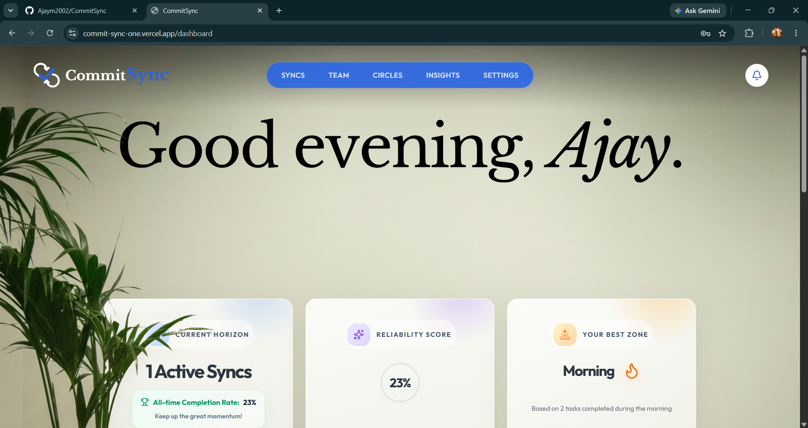
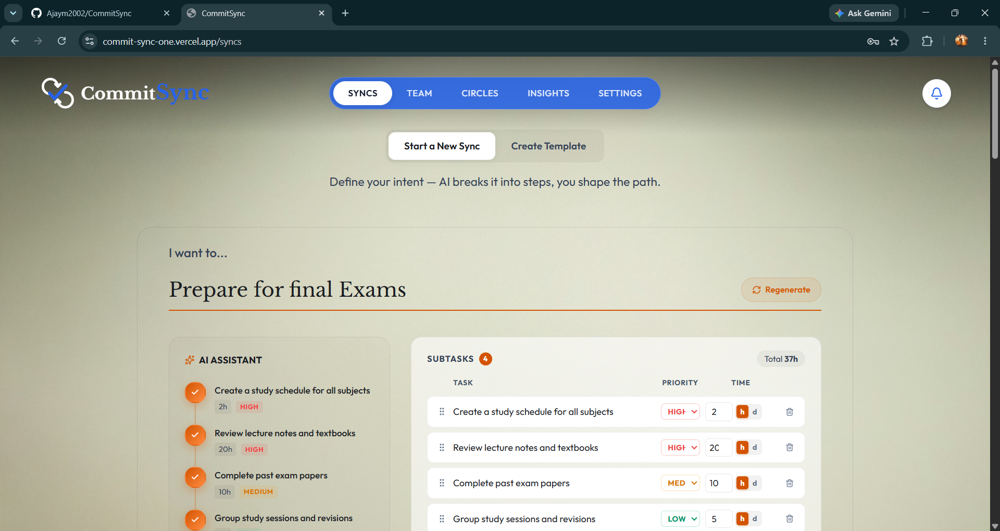
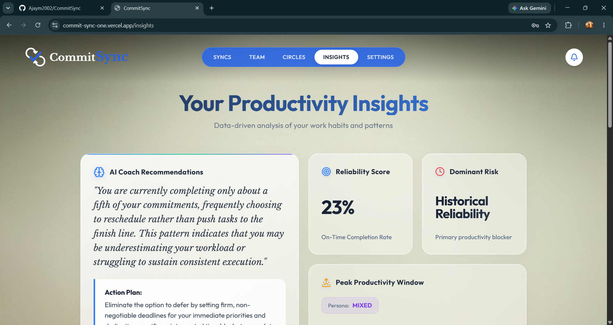
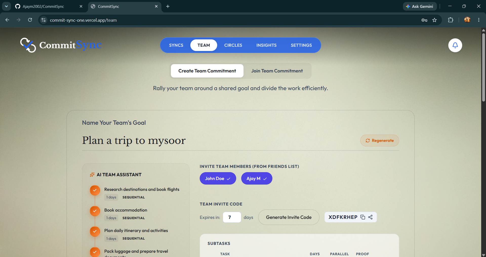
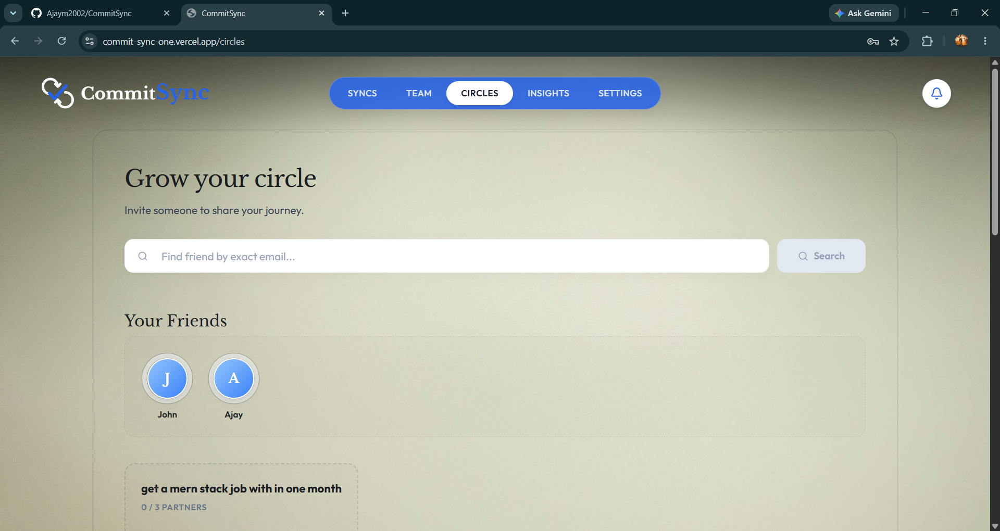
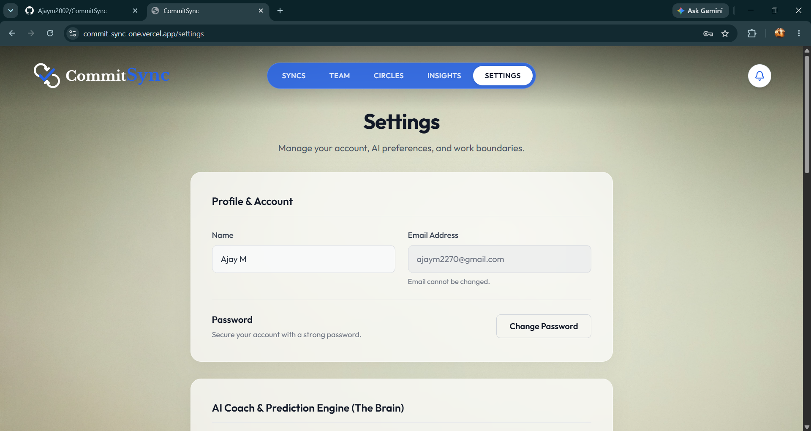
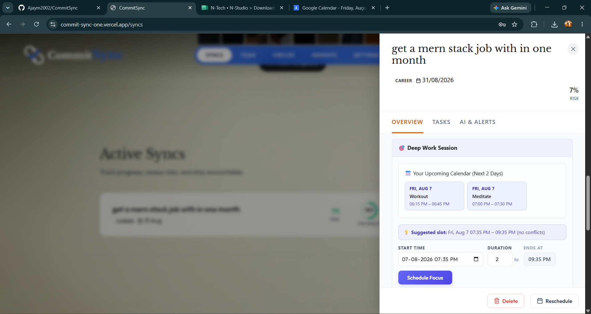
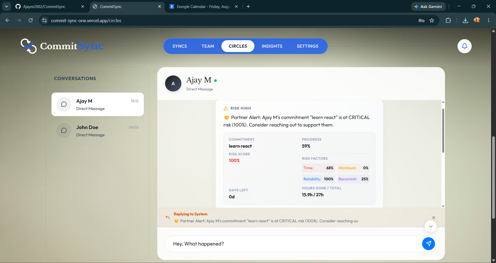

<div align="center">

# 🔗 CommitSync

**Human-Aware Commitment & Deadline Reliability System**

_Track, score, and predict your personal and team commitments — with AI-powered risk analysis and real-time collaboration._

[](https://commitsync-frontend.vercel.app)
[](https://commitsync-backend.onrender.com/health)
[](LICENSE)
[](https://react.dev)
[](https://nodejs.org)

</div>

---

## 📖 What Is CommitSync?

CommitSync is a **full-stack productivity and accountability platform** that goes beyond simple to-do lists. It models *how reliable you actually are* — calculating real-time risk scores for every commitment based on your historical track record, complexity, and deadline proximity.

Whether you're an individual tracking personal goals or a team managing shared deliverables, CommitSync surfaces the right signal at the right time: **which commitment is most likely to slip, and why**.

### Key Capabilities

| Feature | Description |
|---|---|
| 🎯 **Syncs (Commitments)** | Create, track, and categorize personal commitments with deadlines, progress, and priority |
| 📊 **AI Risk Scoring** | Per-commitment risk score (0–100) recalculated every 30 min via cron — backed by a Groq LLM and a custom heuristic engine |
| 👥 **Circles (Friends)** | Add friends, compare reliability scores, and keep each other accountable |
| 🏢 **Team Commitments** | Collaborative workspace with team-level risk dashboards and member accountability |
| 💬 **Real-Time Chat** | Socket.IO-powered in-app messaging between friends and team members |
| 📅 **Google Calendar Sync** | OAuth2 integration to push/pull commitments to Google Calendar |
| 🔔 **Smart Notifications** | Email alerts (via Nodemailer/SMTP) and in-app notifications for approaching deadlines |
| 📈 **Insights & Analytics** | Completion rates, risk trends, streak tracking, and category-level breakdowns via Recharts |
| 🤖 **AI Retrospectives** | Groq LLM automatically generates retrospectives when a commitment is marked MISSED |
| 📋 **Commitment Templates** | Smart template matching to fast-track creating common recurring commitments |

---

## 🖼️ Screenshots

> **Live App:** [commitsync-frontend.vercel.app](https://commitsync-frontend.vercel.app)

<!-- Add screenshots to docs/screenshots/ and update the paths below -->

| Dashboard | Syncs (Commitments) |
|:---:|:---:|
|  |  |

| Insights & Analytics | Team Workspace |
|:---:|:---:|
|  |  |

| Circles (Friends) | Settings |
|:---:|:---:|
|  |  |

| Google Calendar Integration + AI Focus Scheduling |
|:---:|
|  |

| Real-Time Chat with AI Risk Alerts |
|:---:|
|  |

---

## 🏗️ Architecture

```
CommitSync
├── commitsync-frontend/          # React 19 SPA (Vite + TailwindCSS)
│   ├── src/
│   │   ├── pages/                # Route-level pages (Dashboard, Syncs, Team, Circles, Insights, Settings)
│   │   ├── components/           # Reusable UI components (auth, dashboard, circles, marketing)
│   │   ├── contexts/             # React Context providers (AuthContext, SocketContext)
│   │   ├── api/                  # Axios API layer — one file per resource
│   │   └── utils/                # Shared helpers
│   └── vercel.json               # SPA rewrite rule for client-side routing
│
└── commitsync-backend/           # Node.js + Express REST API
    ├── server.js                 # Entry point — Express, Socket.IO, cron jobs
    ├── config/                   # DB connection, app config
    ├── routes/                   # Express routers (auth, commitments, teams, chat, ...)
    ├── controllers/              # Request handlers
    ├── models/                   # Mongoose schemas (User, Commitment, Team, ...)
    ├── services/
    │   ├── riskCalculator.js     # Heuristic risk engine (deadline proximity, history, complexity)
    │   ├── predictionService.js  # Groq LLM integration for AI predictions & retrospectives
    │   ├── aiInsightsService.js  # Natural-language insights generation
    │   ├── calendarService.js    # Google Calendar OAuth2 integration
    │   ├── emailService.js       # Nodemailer/SMTP transactional emails
    │   └── templateMatcher.js    # Smart commitment template matching
    ├── middleware/               # Auth (JWT), error handling, validation
    └── utils/                    # Shared utilities (ioStore for Socket.IO singleton)
```

### System Architecture Diagram

```
┌─────────────────────────────────────────────────────────┐
│                     CLIENT (Vercel)                      │
│  React 19 + Vite + TailwindCSS + Framer Motion          │
│  ┌──────────┐ ┌──────────┐ ┌──────────┐ ┌──────────┐   │
│  │Dashboard │ │  Syncs   │ │  Teams   │ │Insights  │   │
│  └────┬─────┘ └────┬─────┘ └────┬─────┘ └────┬─────┘   │
│       │  React Query (HTTP)      │  Socket.IO (WS)       │
└───────┼──────────────────────────┼───────────────────────┘
        │                          │
┌───────▼──────────────────────────▼───────────────────────┐
│                  REST API + WebSocket (Render)            │
│  Express.js                                              │
│  ┌─────────┐ ┌─────────┐ ┌─────────┐ ┌─────────────┐   │
│  │  /auth  │ │/commits │ │ /teams  │ │  /analytics │   │
│  └─────────┘ └─────────┘ └─────────┘ └─────────────┘   │
│                                                          │
│  ┌──────────────────┐  ┌───────────────────────────┐    │
│  │  Risk Calculator │  │  Groq LLM (AI Insights)   │    │
│  │  (node-cron)     │  │  Prediction + Retro       │    │
│  └──────────────────┘  └───────────────────────────┘    │
└───────────────────┬──────────────────────────────────────┘
                    │
        ┌───────────▼──────────────┐
        │     MongoDB Atlas         │
        │  Users · Commitments     │
        │  Teams · Chat · Notifs   │
        └──────────────────────────┘
```

---

## 🛠️ Tech Stack

### Frontend
| Technology | Purpose |
|---|---|
| **React 19** | UI framework |
| **Vite 7** | Build tool & dev server |
| **TailwindCSS 4** | Utility-first styling |
| **Framer Motion** | Animations & transitions |
| **React Router v7** | Client-side routing |
| **TanStack React Query v5** | Server state management & caching |
| **Socket.IO Client** | Real-time WebSocket communication |
| **Recharts** | Data visualization & analytics charts |
| **React Hook Form** | Form state management |
| **dnd-kit** | Drag-and-drop commitment reordering |
| **Lucide React + React Icons** | Icon libraries |
| **date-fns** | Date formatting & manipulation |
| **Axios** | HTTP client |

### Backend
| Technology | Purpose |
|---|---|
| **Node.js + Express** | REST API server |
| **MongoDB + Mongoose** | Database & ODM |
| **Socket.IO** | Real-time bidirectional communication |
| **Groq AI (Qwen 3.6-27b)** | LLM for risk prediction, retrospectives & insights |
| **Google APIs** | OAuth2 & Calendar integration |
| **node-cron** | Scheduled risk recalculation & overdue escalation |
| **Nodemailer** | Transactional email (OTP, deadline alerts) |
| **JWT + bcryptjs** | Authentication & password hashing |
| **express-validator** | Request validation |

### Infrastructure & Deployment
| Service | Role |
|---|---|
| **Vercel** | Frontend hosting (auto-deploy from GitHub) |
| **Render** | Backend API hosting |
| **MongoDB Atlas** | Managed cloud database |
| **GitHub** | Source control |

---

## 🚀 Getting Started

### Prerequisites
- Node.js >= 18
- npm >= 9
- A MongoDB Atlas cluster ([free tier](https://www.mongodb.com/cloud/atlas/register))
- A Groq API key ([free at console.groq.com](https://console.groq.com))
- A Gmail account with an [App Password](https://support.google.com/accounts/answer/185833) for SMTP
- _(Optional)_ Google Cloud project with OAuth 2.0 credentials for Calendar sync

---

### 1. Clone the Repository

```bash
git clone https://github.com/Ajaym2002/CommitSync.git
cd CommitSync
```

---

### 2. Backend Setup

```bash
cd commitsync-backend
npm install
```

Copy the environment template and fill in your values:

```bash
cp .env.example .env
```

Open `.env` and configure the required fields:

```env
# Server
NODE_ENV=development
PORT=8000

# MongoDB Atlas
MONGODB_URI=mongodb+srv://<username>:<password>@cluster0.xxx.mongodb.net/?appName=Cluster0

# JWT
JWT_SECRET=<your-random-secret-at-least-32-chars>
JWT_EXPIRE=30d

# CORS — set to your frontend URL
CORS_ORIGIN=http://localhost:5173
FRONTEND_URL=http://localhost:5173

# Groq AI (required for risk prediction & AI retrospectives)
GROQ_API_KEY=<your-groq-api-key>
GROQ_MODEL=qwen/qwen3.6-27b

# Email / SMTP (required for OTP registration)
SMTP_HOST=smtp.gmail.com
SMTP_PORT=465
SMTP_USER=<your-email@gmail.com>
SMTP_PASS=<your-gmail-app-password>

# Google OAuth (optional — only needed for Calendar sync)
GOOGLE_CLIENT_ID=<your-google-client-id>
GOOGLE_CLIENT_SECRET=<your-google-client-secret>
GOOGLE_REDIRECT_URI=http://localhost:8000/api/auth/google/callback
```

Start the dev server:

```bash
npm run dev
# API running at http://localhost:8000
```

---

### 3. Frontend Setup

```bash
cd ../commitsync-frontend
npm install
```

Copy and configure the environment:

```bash
cp .env.example .env
```

```env
# Point to your local backend
VITE_API_URL=http://localhost:8000/api
```

Start the dev server:

```bash
npm run dev
# App running at http://localhost:5173
```

---

## ☁️ Deployment

### Frontend → Vercel

1. Push your repo to GitHub.
2. Import it in [Vercel](https://vercel.com/new) → set **Root Directory** to `commitsync-frontend`.
3. Add the environment variable: `VITE_API_URL=https://<your-backend>.onrender.com/api`
4. Deploy. The `vercel.json` rewrite rule handles client-side routing automatically.

### Backend → Render

1. Create a new **Web Service** in [Render](https://render.com).
2. Set **Root Directory** to `commitsync-backend`, **Build Command** to `npm install`, **Start Command** to `node server.js`.
3. Add all environment variables from `.env.example` with production values.
4. Deploy.

> ⚠️ **Note:** Render free-tier services spin down after inactivity. The first request after a cold start may take ~30 seconds.

---

## 📡 API Reference

Base URL: `https://commitsync-backend.onrender.com/api`

| Method | Endpoint | Description | Auth |
|---|---|---|---|
| `GET` | `/health` | Service health check | None |
| `POST` | `/auth/register` | OTP-based registration | None |
| `POST` | `/auth/login` | Login, returns JWT | None |
| `GET` | `/auth/google` | Google OAuth redirect | None |
| `GET` | `/commitments` | List user commitments | JWT |
| `POST` | `/commitments` | Create a commitment | JWT |
| `PATCH` | `/commitments/:id` | Update / reschedule | JWT |
| `GET` | `/commitments/:id/risk` | Risk score details | JWT |
| `GET` | `/analytics` | Completion rate, streaks, breakdowns | JWT |
| `GET` | `/teams` | List user's teams | JWT |
| `POST` | `/teams` | Create a team | JWT |
| `GET` | `/teams/:teamId/commitments` | Team commitments | JWT |
| `GET` | `/friends` | List friends | JWT |
| `POST` | `/friends/request` | Send friend request | JWT |
| `GET` | `/chat/:conversationId` | Get messages | JWT |
| `GET` | `/notifications` | In-app notifications | JWT |
| `GET` | `/templates` | Commitment templates | JWT |

---

## 🔄 Scheduled Tasks (Cron)

| Schedule | Task |
|---|---|
| Every 15 min | Auto-escalate overdue commitments → `MISSED` + risk to 100 |
| Every 30 min (configurable) | Recalculate risk scores for all active commitments |
| On MISSED event | Trigger Groq LLM to generate an AI retrospective |

---

## 🗂️ Data Models

```
User            → email, passwordHash, reliabilityScore, googleTokens
Commitment      → title, deadline, progress, status, riskScore, riskHistory, category
Team            → name, members[], owner
TeamCommitment  → team ref, assignee, deadline, progress, riskScore
RiskSnapshot    → commitment ref, score, level, calculatedAt
Notification    → user ref, type, message, read
ChatMessage     → conversation ref, sender, content, timestamp
Template        → title, category, defaultDuration, suggestedTags
```

---

## 🤝 Contributing

Contributions are welcome! Please follow these steps:

1. Fork the repository
2. Create a feature branch: `git checkout -b feature/your-feature`
3. Commit your changes: `git commit -m 'feat: add your feature'`
4. Push to the branch: `git push origin feature/your-feature`
5. Open a Pull Request

---

## 📄 License

This project is licensed under the **MIT License** — see the [LICENSE](LICENSE) file for details.

---

<div align="center">

Made with ❤️ by **Ajay M** · [GitHub](https://github.com/Ajaym2002)

</div>
